# Skin gallery (render path B)

13 verified skins for the Remotion free-compose path. A skin is **tokens only**
(palette, fonts, shape language, karaoke variant), defined in
[`src/lib/skins.ts`](../../src/lib/skins.ts). Layouts are never part of a skin:
every video composes its own scenes (see [`SCENE-DESIGN.md`](../../SCENE-DESIGN.md)).

Pick **one skin per video**, by content mood. All previews below show the same demo
content restyled, so differences are the skin, not the layout.

| | | |
|---|---|---|
| 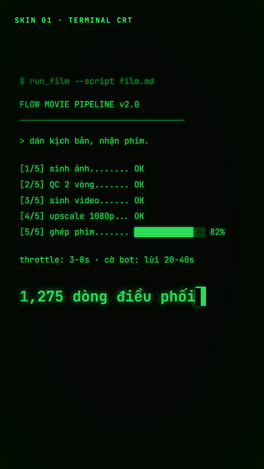 `terminal-crt`: dev tool, hacker, a machine really running | 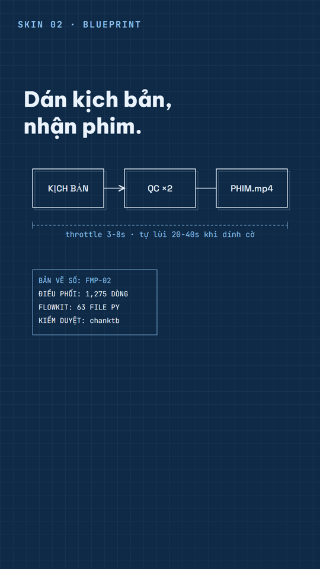 `blueprint`: architecture teardown, how-it-works | 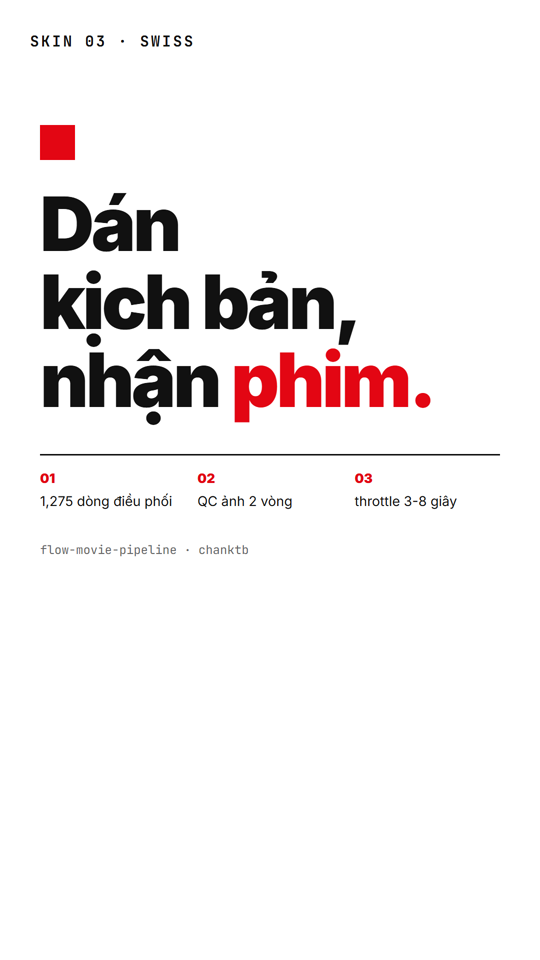 `swiss`: benchmarks, numbers, minimal authority |
| 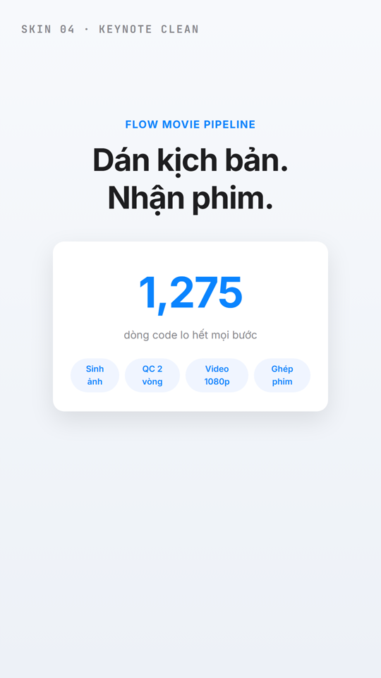 `keynote-clean`: serious product, buying audience | 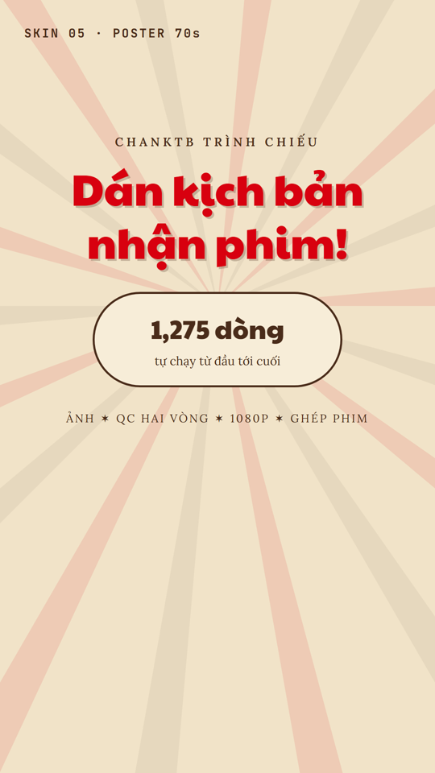 `poster-70s`: retro personality, personal channel | 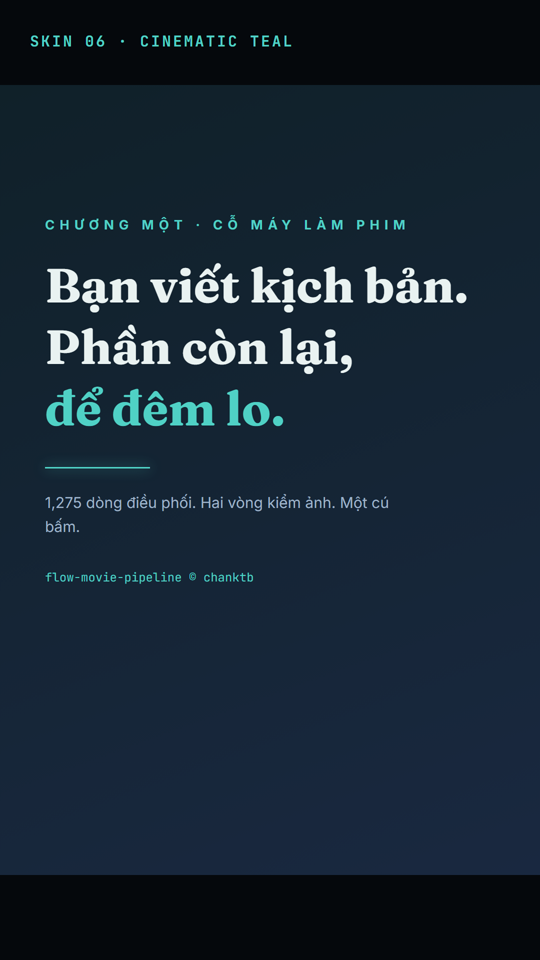 `cinematic-teal`: storytelling, long narrative |
| 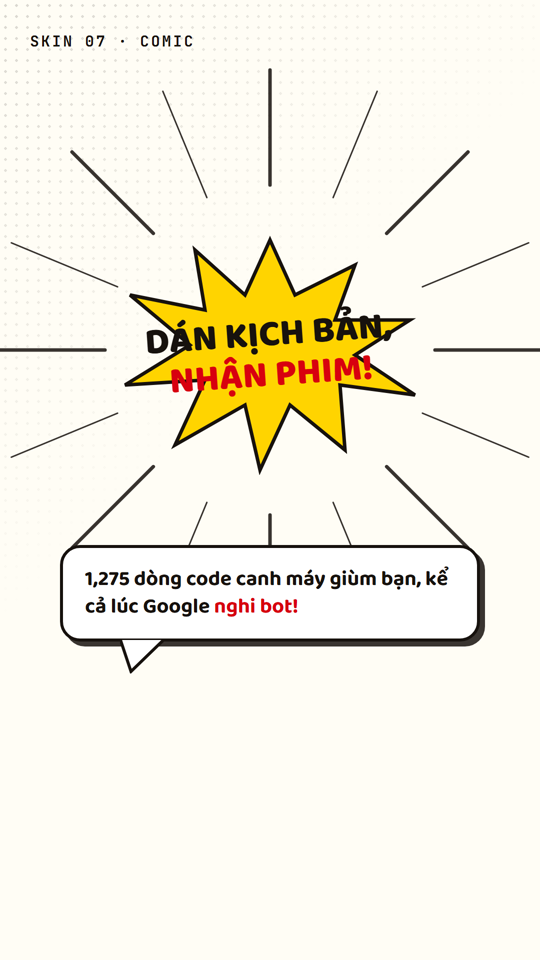 `comic`: hot news, drama, high energy | 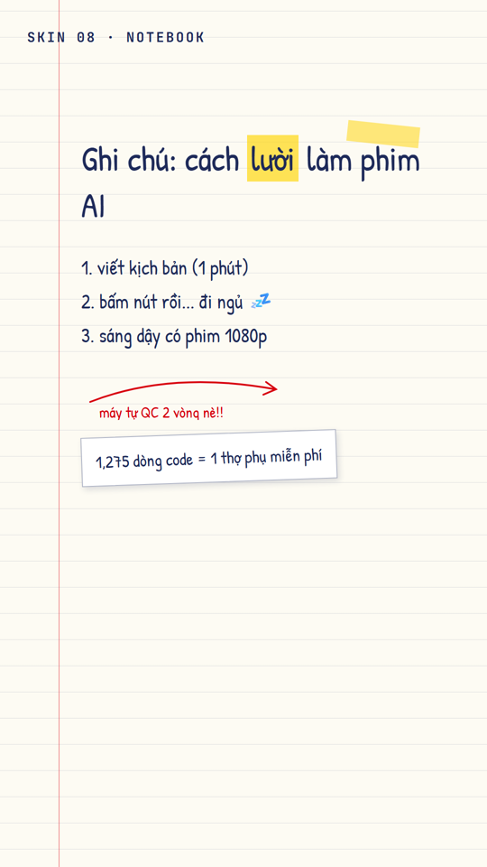 `notebook`: friendly tutorial | 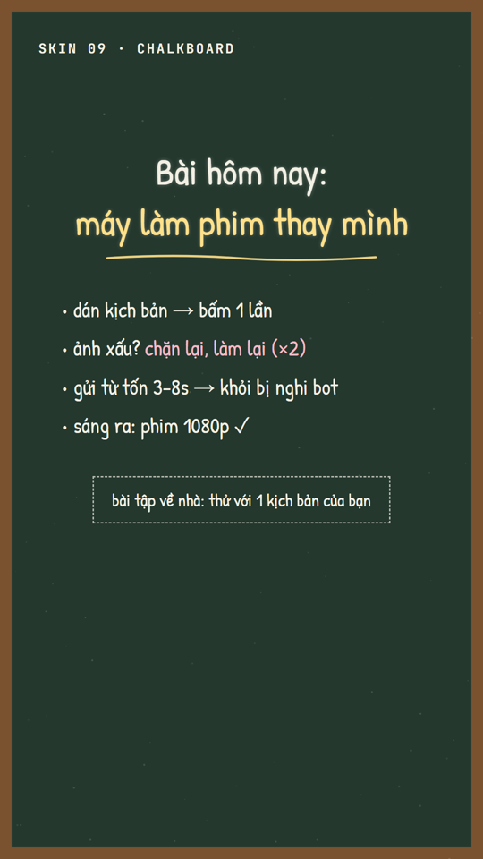 `chalkboard`: teaching, lecture |
| 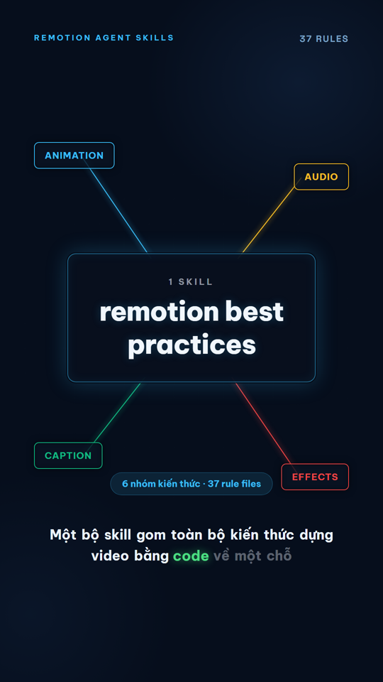 `tech-dark-neon`: tech repo tour, serious with glow | 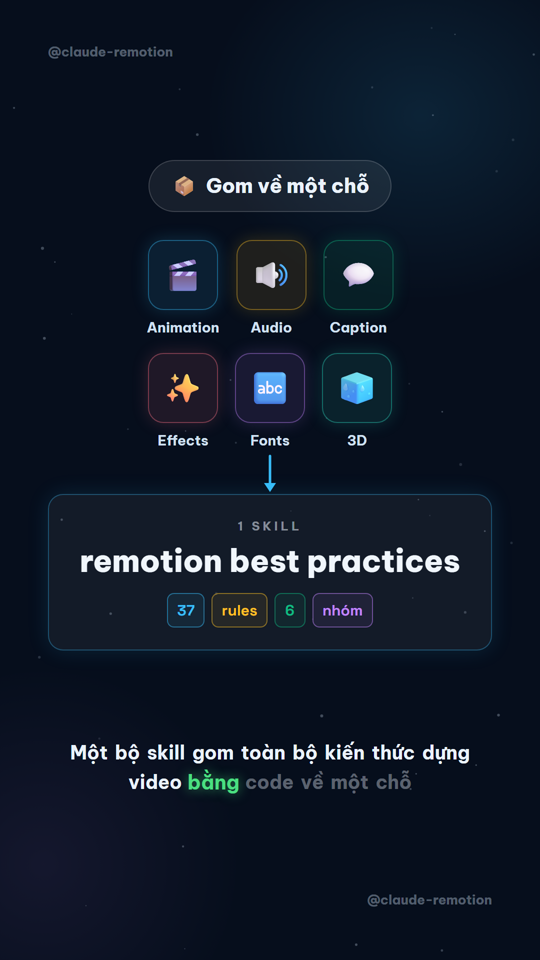 `escbase-starfield`: AI-news infographic, high density | 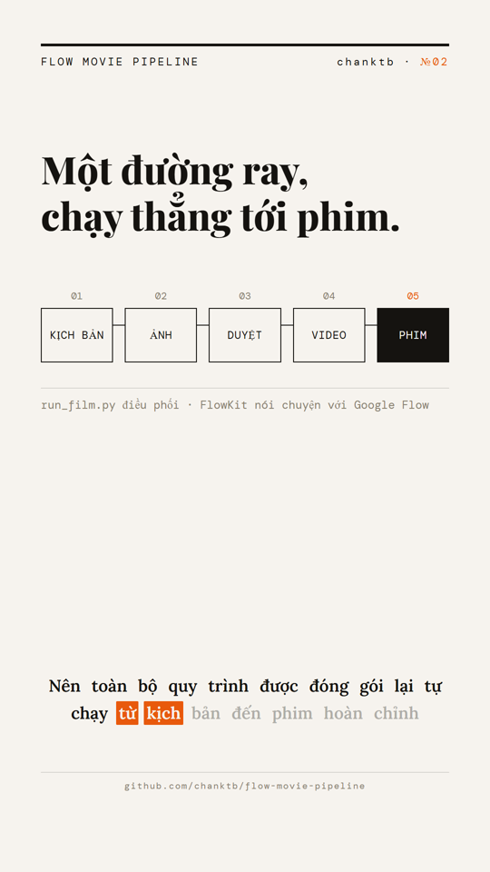 `mono-editorial`: print newspaper, analytical |
| 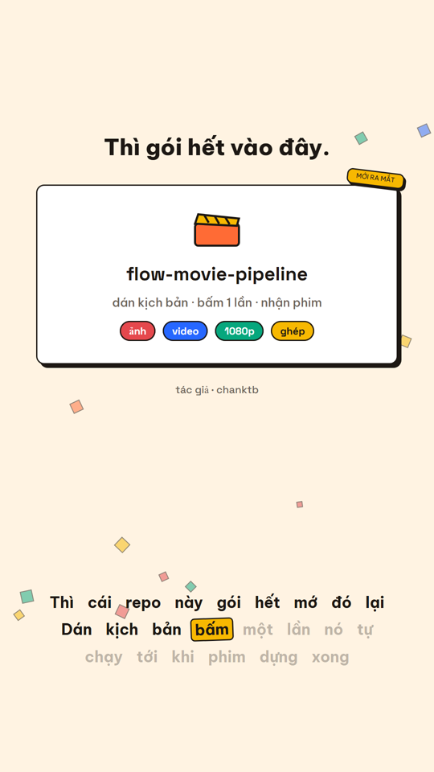 `pop-sticker`: playful mass-market, TikTok/Reels | | |

Karaoke variant per skin: `neon` (dark skins, glow keywords), `marker` (light skins,
highlighter fill), `sticker` (pop skins). Components in
[`src/lib/karaoke.tsx`](../../src/lib/karaoke.tsx).
